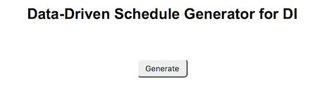
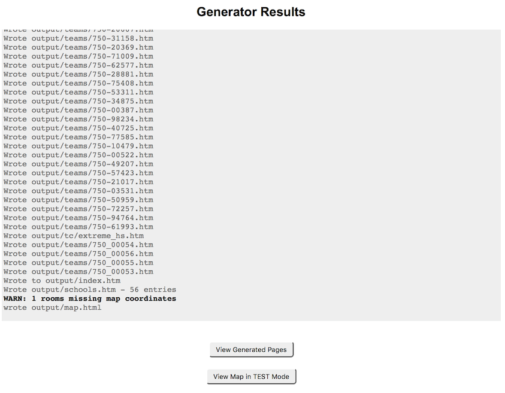

# Generator for DI Event Schedule and Map

This project was originally created for the 2018 Destination Imagination Capital Region Tournament, and the goal is to make this generic enough to leverage for any DI tourney.  It generates a set of static HTML pages for a tournament schedule and map.  

## Features
- **Data-Driven** : No coding required, just edit CSV files and images.
- **Responsive** : Designed for phone, tablet, desktop screens.
- **Low-Cost to Host** : Doesn't require any special web hosting (no database or server runtime).

## Data Files
- **challenges.csv** : Maps challenge names and icon files. Should be able to use as-is after yearly update.
- **strings.json** : Update Date and Region Name.
- **schedfinal.csv** : This is the main data file.  It contains a row for each team, their scheduled times for challenges.  The room assignments are placeholder aliases.
- **room_assignments.csv** : Lists the actual rooms used, as well as the map coordinates for each.
- **images/map.jpg** : Update this with the map image (can be GIF, PNG, JPG) for your own venue.  Actual filename specified in strings.json.

## Docker Dependency
This project has several techie dependencies (Node.js, javascript modules), and using Docker will take care of all of those details for us.

[Docker for MacOS](https://store.docker.com/editions/community/docker-ce-desktop-mac)
[Docker for Windows](https://store.docker.com/editions/community/docker-ce-desktop-windows)

## Running using Docker

On MacOS, double-clicking the **run-docker.command** script will open up a terminal windows and run a small web server inside a Docker container.

Then you set your browser to [http://localhost:8080/](http://localhost:8080/).

You should see the simple page with a single button like the following.

## Generating the HTML files

Clicking the 'Generate' button will produce the files in the **output** subdirectory.  You can immediately see the results in your browser and click links to navigate between pages exactly how your users will be doing.

## Hosting

Transfer the files in the output directory to your hosting server.  This is typically done using SFTP (Secure FTP), FTP, or using a file-manager utility in your admin control panel.

For about $30, you can get a domain (e.g. 'txdi18.com') and a month of hosting at [Network Solutions](https://www.networksolutions.com).
