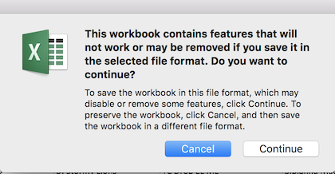
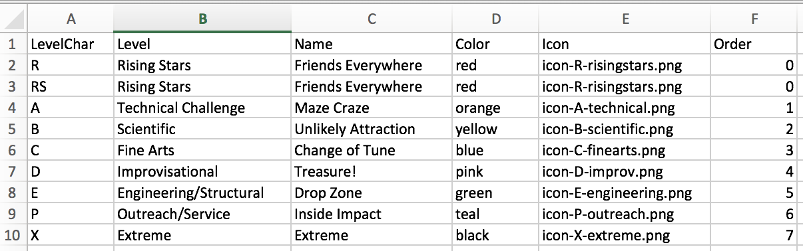
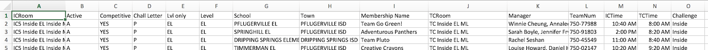
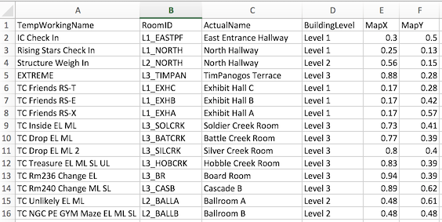

# Getting Your Site Ready

## Notes on File Formats

- **Columns**: The generator does not currently look at names in CSV header rows to identify columns.  Removing or re-ordering columns will result in problems.
- **Saving Changes**: When you make changes to a CSV file in Excel, Numbers, or other applications, it will encourage you to save in a different format.  See screenshot of Excel warning below.  If you save changes, then run the Generator, and don't see the updated values, this could be why.  You could have two different files with the same name, only differing by the file extension (e.g. 'schedfinal.csv' and 'schedfinal.xlsx')  Given that Windows and Mac usually tries to hide the file extensions, it can be tough to know which file is which.

## Challenges File

You shouldn't need to update this file.  Once the names and icons are set for the year, the data is common to all events.

.

## Schedule File

This is the where most of your work will take place.  The current format is a bit repetitive.  The goal is to leverage the format of data required to submit to official scoring. We hope to simplify it for the 2019 year.

Once all teams are signed up, you add one row for each team with their details (Team ID, Team Name, School, Level, Managers, etc).

Then you can start assigning teams to 'virtual rooms' ... not knowing the exact rooms you might have available at the event venue yet.  Therefore, the ICRoom and TCRoom columns are fictitious place-holders.  You know that teams in the same challenge will be in the same room, and if there are enough competitors that they need to be grouped into 'Panels', then you will need a room for each panel.  The 'Room Assignments' file will map the place-holder names to the actual rooms.

- The ICRoom is currently being ignored, since in our scenario, all teams checked-in for their instant challenge at the same specific location.
- The Challenge (last) column is ignored.  The 4th column 'Challenge Letter' is used instead.
- The 5th columns is used to establish the level.  We should be able to skip this column and use the 6th.
- The 6th columns (Level) is used to extract the assigned 'Panel' group.  It should be in the format 'Level-Panel'.

.

## Room Assignments

.

## Map Image

The map image should be high resolution.  The best test is to view the image on your phone, and pinch-zoom-in as far as possible... the user should easily be able to see the required detail, such as the room numbers.  The image used originally was a map of Westlake High-School, a complicated 3-level sprawl of buildings, and it was 2400x2400 pixels.

**Note on File Size**: Once you have the right resolution, work to minimize the file size.  The cellular reception is usually not very good inside buildings, and speed can be slow.  You don't want the users to have to download a 3MB image.  For JPEG images, you can alter the quality setting, but that could result in the details being too fuzzy.  Consider a PNG or GIF with limited color palette or grayscale.  It can change an image from 1.9MB to 500KB.  The best option I have found is Photoshop or Illustrator's old 'export for web' GIF.

## Map Room Coordinates

The coordinates used are a decimal between 0.00 and 1.00, representing the 0-100% of the width or height.  This allows for any size image at any scale.

To help in obtaining the coordinates, put your map image in place ('images/map.jpg'), run the generator service and click the 'Generate' button.  On the results page, click the 'View Map in TEST mode' button.  This will show the map, and the coordinates will appear in the top-left as you move the mouse over the image.  It's recommended to have the **room_assignments.csv** file open in a spreadsheet application like Excel while you are doing this.  For each row in the spreadsheet, find the room or location on the map with the mouse and note the coordinates.  Update the spreadsheet row coordinates.

