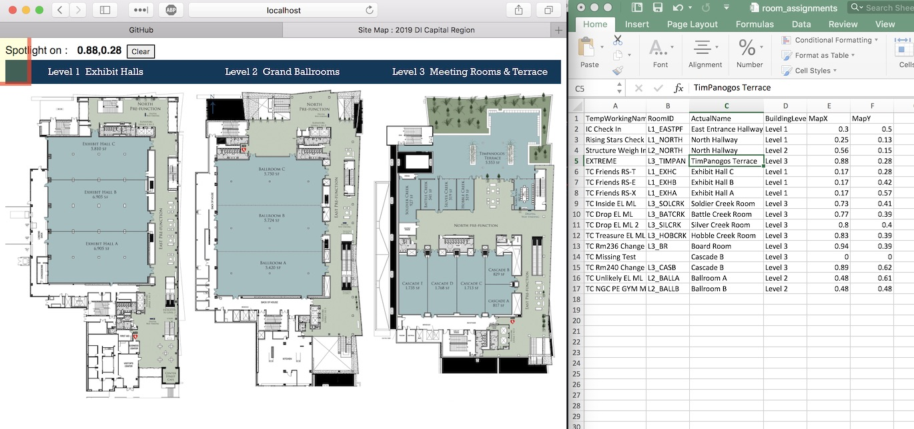

# Getting Your Site Ready

## Map Image

The map image should be high resolution.  The best test is to view the image on your phone, and pinch-zoom-in as far as possible... the user should easily be able to see the required detail, such as the room numbers.  The image used originally was a map of Westlake High-School, a complicated 3-level sprawl of buildings, and it was 2400x2400 pixels.

**Note on File Size**: Once you have the right resolution, work to minimize the file size.  The cellular reception is usually not very good inside buildings, and speed can be slow.  You don't want the users to have to download a 3MB image.  For JPEG images, you can alter the quality setting, but that could result in the details being too fuzzy.  Consider a PNG or GIF with limited color palette or grayscale.  It can change an image from 1.9MB to 500KB.  The best option I have found is Photoshop or Illustrator's old 'export for web' GIF.

## Map Room Coordinates

The coordinates used are a decimal between 0.00 and 1.00, representing the 0-100% of the width or height.  This allows for any size image at any scale.

To help in obtaining the coordinates, put your map image in place ('images/map.jpg'), run the generator service and click the 'Generate' button.  On the results page, click the 'View Map in TEST mode' button.  This will show the map, and the coordinates will appear in the top-left as you move the mouse over the image.  It's recommended to have the **room_assignments.csv** file open in a spreadsheet application like Excel while you are doing this.  For each row in the spreadsheet, find the room or location on the map with the mouse and note the coordinates.  Update the spreadsheet row coordinates.

