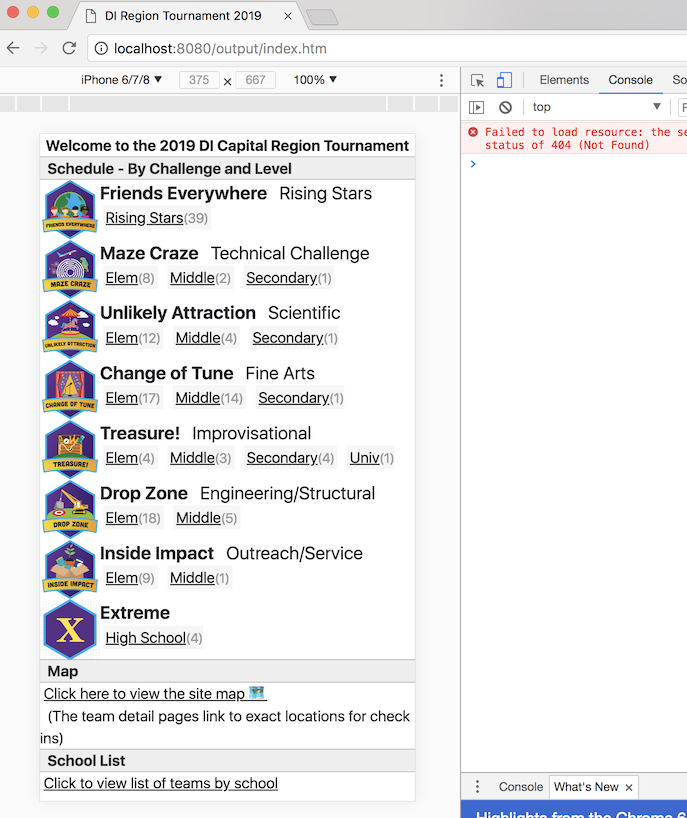
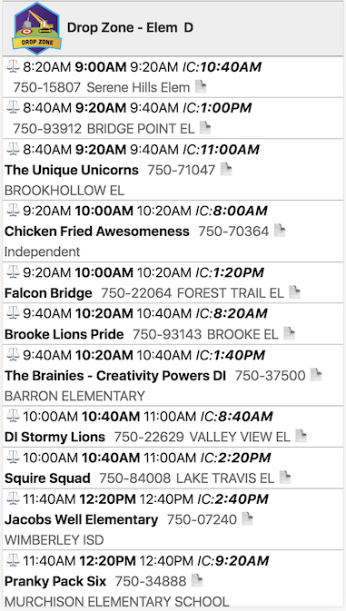
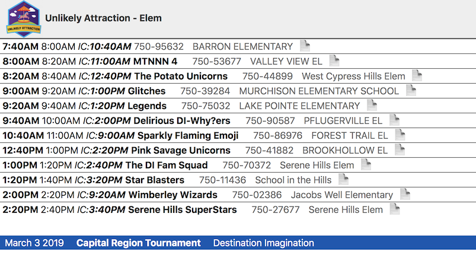
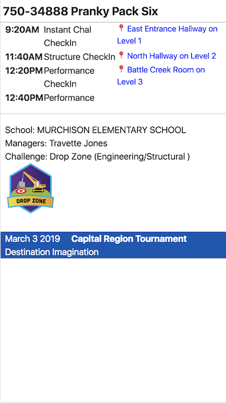
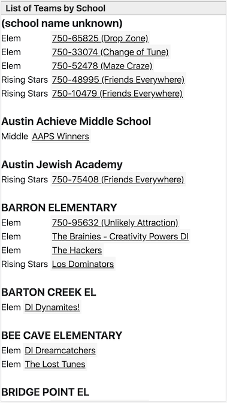
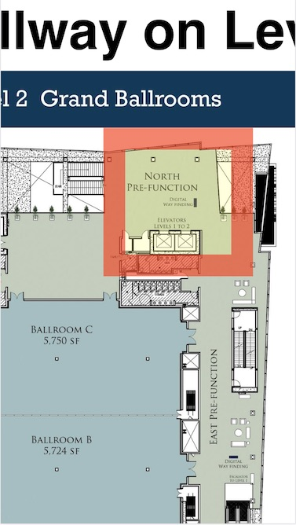

# DI Event Schedule and Map Overview

This document summarizes the user experience for the generated web site pages.

## Home Landing Page

The top level home page is '/index.htm'.  If hosted at the top-level directory of your website, it should be loaded automatically when the user enters the website name (e.g. 'mydisite.com') in the URL bar, without having to specify the 'index.htm' path.

*Side-note: Be aware that people are so conditioned to using search engines like google, that they might enter the domain name (e.g. 'mydisite') in the URL bar and search for it, rather than entering the full name 'mydisite.com'.  A short-lived website will not be in search results.*

To simulate how a site looks on a mobile device, use Chrome browser's 'Developer Tools' under the 'View' menu, and toggle the 'Device Toolbar'.  See the example below, which is displaying the site in 'iPhone 6/7/8' mode.

## Team Challenge Group Pages

Selecting a link under one of the Technical Challenge (TC) sections, such as 'Elem' under 'Drop Zone' will show the 'Group Detail page'.  To avoid confusion, it is not sectioned by panel, but all are together sorted by time.  A balance icon indicates a structure check-in time.  While the entire row is a hyperlink to the 'Team Details' page, the page icon at the end of the row serves as a hint.

The times visible are as follows:
 - Structure Check-in time (*if applicable to Challenge*)
 - TC check-in time in **bold**
 - TC performance time.
 - Instance Challenge (IC) check-in time (*not for Rising Stars*).

The same page viewed on a larger screen, or in landscape mode can display all team details in a single row.

## Team Details Page

The 'Team Details' page includes all times and links to the map locations.  The URL for a team's page includes the team ID (e.g. https://example.com/teams/750-22064.htm).  The Team ID and Team Name form the page header.  The team's times are listed in order, each having a link to the map location.  The TC performance does not have a map link, since the it is already listed on the TC check-in row.  At the bottom of the page, the school, managers, and challenges details are listed.

## Schools Page
The schools page lists each school in alphabetical order, along with each team (Level, Team ID, Team Name).  Teams that don't have a school listed, are under the top-level 'school name unknown' section.

## Map

The map page will usually have a spotlight on a specific location, having linked from a Team Details page.  The map image will be scaled down to fit, and will likely be impossible to see any detail on a small screen.  The user has to pinch-zoom in to view the detail (see second image below).

Map on phone screen, zoomed in on location detail.

